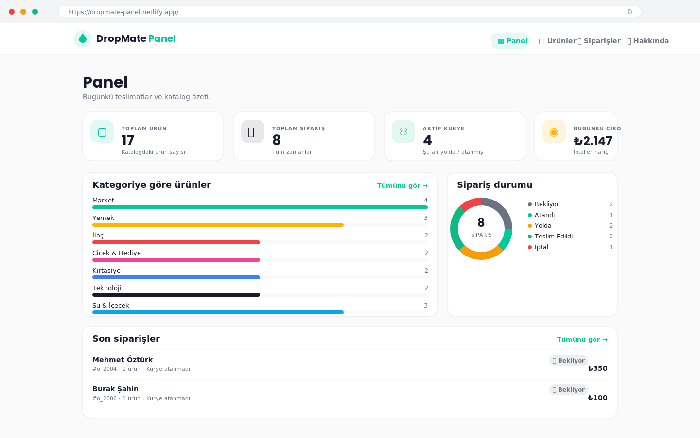
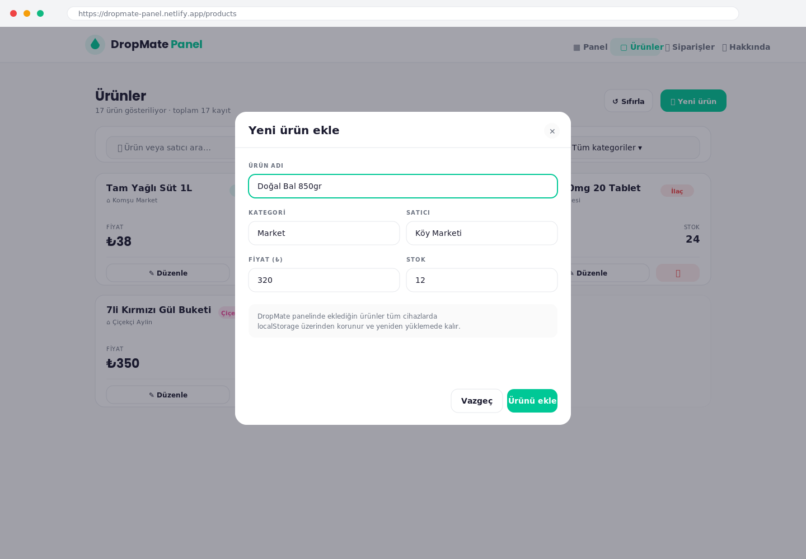

# DropMate Panel

> **Sipariş ver. Komşun getirsin.** — _Order it. Your neighbor delivers it._

DropMate Panel, **DropMate** peer-to-peer teslimat platformunun
**yönetim arayüzüdür**. Ürün kataloğunu yönetmek, gelen siparişleri
takip etmek ve kurye atamak için React + Vite + Tailwind CSS ile
yazılmış tek sayfa bir web uygulamasıdır.

- **Live demo:** https://dropmate-panel.netlify.app/ _(deploy sonrası güncellenecek)_
- **GitHub:**    https://github.com/efesrnn/DropMate_Panel

---

## Ekran görüntüleri

### Panel (Dashboard)


### Ürünler (CRUD modali açık)


---

## Özellikler · Features

- **Dashboard** — toplam ürün, toplam sipariş, aktif kurye, bugünkü ciro özetleri + kategoriye göre ürün bar grafiği + sipariş durumu donut grafiği + son siparişler listesi.
- **Ürünler (CRUD)** — ekle, listele, düzenle, sil. Kategori filtresi ve metin araması. Marka kategorilerine renk kodlu rozetler.
- **Siparişler (CRUD)** — sipariş oluştur, durum güncelle (Bekliyor / Atandı / Yolda / Teslim Edildi / İptal), kurye ata/kaldır, sil. Mod rozetleri (yürüyerek / bisiklet / araba) + komisyon hesabı.
- **localStorage kalıcılığı** — tüm CRUD işlemleri tarayıcıda kalır, sayfa yenilense bile veriler korunur. İlk açılışta mock veriyle seed olur. "Sıfırla" butonu mock veriyi geri yükler.
- **Mobil uyumlu** — md ve lg breakpointlerinde otomatik yerleşim. Mobilde hamburger menü.
- **DropMate marka kimliği** — BRAND_IDENTITY.md dosyasında tanımlanan renkler, tipografi, radius ve gölge tokenleri Tailwind config içinden doğrudan kullanılıyor.

---

## Teknik yığın

| Katman          | Teknoloji                                  |
| --------------- | ------------------------------------------ |
| Framework       | React 19                                   |
| Build aracı     | Vite 8                                     |
| Stil            | Tailwind CSS 3 + custom design tokens      |
| Yönlendirme     | react-router-dom v6                        |
| İkonlar         | lucide-react                               |
| Kalıcı veri     | Tarayıcı localStorage                      |
| Dil             | Modern JavaScript (ES2022) + JSDoc tipler  |

---

## Klasör yapısı

```
DropMate_Panel/
├── public/
│   ├── _redirects                 # Netlify SPA fallback
│   ├── favicon.svg
│   └── icons.svg
├── screenshots/
│   ├── 01-dashboard.png
│   └── 02-products.png
├── src/
│   ├── components/
│   │   ├── CategoryBadge.jsx
│   │   ├── CategoryBar.jsx
│   │   ├── Layout.jsx
│   │   ├── Modal.jsx
│   │   ├── ModeBadge.jsx
│   │   ├── Navbar.jsx
│   │   ├── OrderForm.jsx
│   │   ├── OrderRow.jsx
│   │   ├── ProductCard.jsx
│   │   ├── ProductForm.jsx
│   │   ├── StatCard.jsx
│   │   ├── StatusBadge.jsx
│   │   └── StatusDonut.jsx
│   ├── data/
│   │   ├── mockOrders.js
│   │   └── mockProducts.js
│   ├── hooks/
│   │   ├── useLocalStorage.js
│   │   ├── useOrders.js
│   │   └── useProducts.js
│   ├── interfaces/
│   │   ├── Order.js
│   │   └── Product.js
│   ├── pages/
│   │   ├── About.jsx
│   │   ├── Dashboard.jsx
│   │   ├── Orders.jsx
│   │   └── Products.jsx
│   ├── App.jsx
│   ├── index.css
│   └── main.jsx
├── index.html
├── netlify.toml
├── package.json
├── postcss.config.js
├── tailwind.config.js
└── vite.config.js
```

> `interfaces/` klasörü JSDoc `@typedef` lerini tutar — JS projesi olduğumuz için tip güvenliği IDE intellisense üzerinden sağlanır.

---

## Local kurulum

```bash
git clone https://github.com/efesrnn/DropMate_Panel.git
cd DropMate_Panel

npm install
npm run dev
```

Vite varsayılan olarak `http://localhost:5173` adresinde açılır.

### Komutlar

| Komut             | Açıklama                                  |
| ----------------- | ----------------------------------------- |
| `npm run dev`     | Geliştirme sunucusu (HMR)                 |
| `npm run build`   | `dist/` altına production build           |
| `npm run preview` | Build edilmiş çıktıyı yerelde önizle      |

---

## Netlify Deploy

DropMate Panel saf bir frontend SPA olduğu için Netlify, Vercel, Cloudflare Pages, GitHub Pages — istediğin yere deploy edebilirsin. Aşağıda Netlify adımları:

**1. Netlify'da yeni site**

1. https://app.netlify.com → **Add new site** → **Import from Git**.
2. **GitHub**'ı seç, repoya yetki ver, `efesrnn/DropMate_Panel`'i seç.
3. Build ayarları (zaten `netlify.toml` içinde belirtilmiş):
   - **Build command:** `npm run build`
   - **Publish directory:** `dist`
4. **Deploy site**.

**2. SPA route fix**

React Router kullandığımız için `/products` gibi adreslerin direkt açılabilmesi için `public/_redirects` dosyası zaten ekli:

```
/*    /index.html   200
```

**3. Live URL'yi README'ye işle**

Deploy bittiğinde Netlify sana `https://<rastgele>.netlify.app` verecek. İstersen **Site settings → Change site name** ile `dropmate-panel`'e çevir ve bu README'nin tepesindeki **Live demo** satırını güncelle.

---

## Notlar

- DropMate Panel, DropMate dört-parça eko-sisteminin **web yönetici** parçasıdır. Diğerleri: `01_Figma_UIUX_DropMate` (mobil mock-up), `03_SQL_Database_DropMate` (veritabanı), `DropMate` (kullanıcı tarafı Flutter app).
- Renk, tipografi ve dil kuralları için tek doğru kaynak proje kökündeki `BRAND_IDENTITY.md` dosyasıdır.
- Bu uygulama bilinçli olarak backend'siz tasarlandı; gerçek ortamda `useProducts` / `useOrders` hooklarındaki localStorage çağrıları, ileride bir REST API çağrısıyla değiştirilebilir.

---

**Geliştiren:** Efe Serin · `plus.medtrack@gmail.com` · GitHub [@efesrnn](https://github.com/efesrnn)
